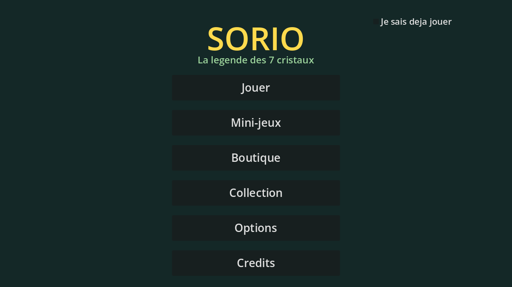

# SORIO

Jeu de plateforme 2D à défilement latéral pour Android, dans un univers
préhistorique fantastique. **Godot 4.7.1**, GDScript typé.

> Le père de SORIO s'est effondré le jour où un météore est tombé au fond de
> la Vallée des Fougères. Celui qui réunit les 7 Cristaux Célestes peut gravir
> le Sanctuaire, invoquer ALTO le Dieu-Ptéranodon, et formuler un vœu.

**Priorité absolue du projet : un enfant de 8 ans qui n'a jamais vu le jeu
doit comprendre comment jouer en moins de 60 secondes, sans lire une notice.**
Quand un choix technique et un choix d'ergonomie s'opposent, l'ergonomie
gagne.

## Contenu visé

8 mondes · 36 pouvoirs · 17 ennemis · 8 boss · un mode Course en fausse 3D ·
10 mini-jeux.

## Démarrer

```bash
./tools/setup_env.sh          # installe Godot 4.7.1 et les modèles d'export
GODOT=~/.local/share/sorio-tools/godot

$GODOT --path .                                                    # jouer
$GODOT --headless --path . res://src/tools/validate_project.tscn   # valider
$GODOT --headless --path . res://src/tools/run_tests.tscn          # tester
```

## Trois décisions d'architecture

1. **Les niveaux sont de l'ASCII.** Un niveau est un fichier `.txt` lisible,
   modifiable et testable sans ouvrir l'éditeur, construit à l'exécution par
   `LevelBuilder` et validé par `lint_levels`.
2. **Les 36 pouvoirs sont 8 briques d'effets + 36 fichiers de configuration.**
   Ajouter un 37ᵉ pouvoir ne demande qu'un `.tres`, zéro ligne de code.
3. **Rien ne passe par l'éditeur.** Scènes écrites en texte, validées en
   headless ; captures d'écran automatisées pour le contrôle visuel.

## Documentation

| Fichier | Contenu |
|---|---|
| `CLAUDE.md` | stack, conventions, commandes, état |
| `PROGRESS.md` | avancement des 12 passes |
| `docs/AJOUTER_DU_CONTENU.md` | ajouter pouvoir / ennemi / niveau / mini-jeu |
| `docs/EDITEUR.md` | ce qui exige vraiment l'éditeur (rien, à ce jour) |
| `docs/EXPORT_ANDROID.md` | procédure d'export APK |

## État

Passe 0 (fondations) terminée, passe 1 (socle plateforme) en cours. Voir
`PROGRESS.md`.


